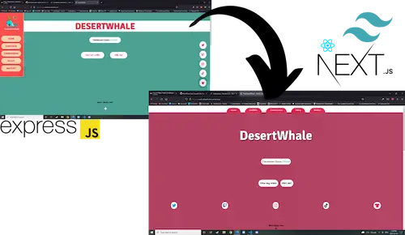

# :hammer:  React w/ Next.js & TypeScript rebuild of TheDesertWhale's Art & Commission website :wrench:

*Project by Mike Allison (Huntthee)*

---

## What's going on here!?
I am rebuilding a site first constructed with `EJS/Node` & hosted on `Heroku`, and creating it basically anew with `React/Next.js/TypeScript` and `Tailwind CSS` with hosting by `Vercel` once completed.

This project has been and will continue to provide me with an excellent way to practice React/Next.js and Tailwind CSS for use on future projects.

## Want to see how things are looking?
You can check out the current state of the project and keep tabs on its progress by visiting the development site hosted by Vercel at [next-desert-site.vercel.app]('https://next-desert-site.vercel.app').

## Attributions
All of the technologies and images used within this project have come from the following sources.

 - [Next.js Documentation]('https://nextjs.org/docs/getting-started')
 - [Tailwind CSS Documentation]('https://tailwindcss.com/docs/installation')
 - [TheDesertWhale.com]('https://www.thedesertwhale.com')